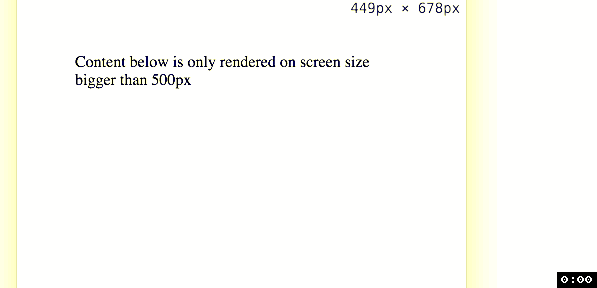

react-match-media
=====================

A [React](https://github.com/facebook/react) component that allows you to conditionally render your components based on media queries. 
Underline it uses [window.matchMedia](https://developer.mozilla.org/en/docs/Web/API/Window/matchMedia)

## Use cases
If you have a resonsive website that initially renders mobile first content, and then conditionally load more contents (like ads) based on screen size or any other type of media queries, this component might be useful for you.

### Why not use css media query to hide component?
For most use case, css media query is good enough. This lib is useful if you don't want to render a react component that talks to thirdparty API/adServer for certain screen size (or any other media queries).



## Usage
### Install
```
npm i react-match-media
```

### Use it in your code (es6 syntax)
```javascript
import React from 'react';
import ReactDOM from 'react-dom';
import { MatchMedia } from 'react-match-media';

ReactDOM.render(
  <div className="example">
    <SomeElementAlwaysRendered />
    <MatchMedia mediaQuery={'(min-width: 800px)'}>
      <ElementRenderedWhenMatchMediaQuery />
    </MatchMedia>
  </div>,
  document.getElementById('root')

```
For more, see the [examples](./examples)

### Supported browsers
  - IE10 and above
  - All other major browsers

For more, see [Can I Use matchMedia](http://caniuse.com/#search=matchMedia)

## Development of this component

### Start the example

```
npm install
npm start
open http://localhost:3000
```
And then you can edit the source code, hotreloading is enabled, so you can see the changes immediatly

### Linting

```
npm run lint
```

### Testing

```
npm run test 
```

### To generate distribution code

```
npm run build
```

### License
MIT
